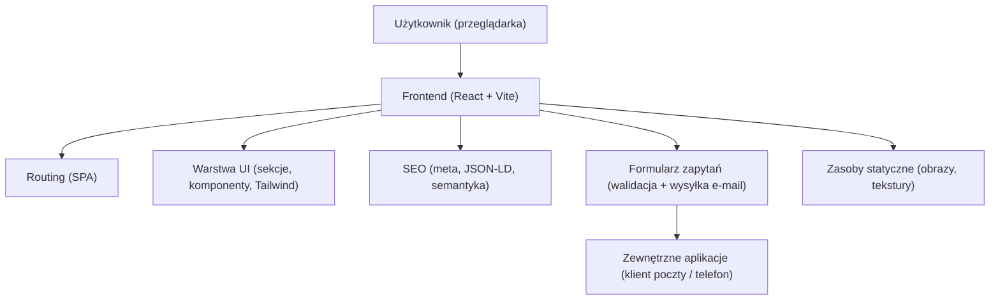

## 1. Projekt architektury

Założenie: aplikacja jest statyczna (frontend-only) i może być hostowana na dowolnym hostingu plików statycznych. Wysyłka zapytania odbywa się przez przygotowanie wiadomości e-mail (mailto) lub kliknięcie w telefon/e-mail.

## 2. Opis technologii
- Frontend: React@18 + Vite + TypeScript
- Stylowanie: tailwindcss@3 (z własnymi tokenami kolorów i typografią w theme)
- Routing: react-router-dom (podstrony: /, /pokoje, /galeria, /blog, /blog/:slug, /kontakt)
- Animacje: IntersectionObserver + CSS transitions (bez zewnętrznych bibliotek)
- SEO: ręcznie ustawiane meta (react-helmet-async lub prosty “meta manager” zależnie od decyzji implementacyjnej), JSON-LD w head

## 3. Definicje tras
| Trasa | Cel |
|------|-----|
| / | Strona główna (sekcje: hero, galeria, opinie, FAQ, blog, formularz, stopka) |
| /pokoje | Prezentacja standardu pokoi i apartamentów + CTA do formularza |
| /galeria | Galeria kategorii + lightbox |
| /blog | Lista wpisów SEO |
| /blog/:slug | Strona wpisu (Article schema) |
| /kontakt | Formularz i dane kontaktowe |

## 4. Integracje i dane
- Dane treści (opinie, FAQ, wpisy blogowe, zdjęcia) jako statyczne JSON/TS moduły w repozytorium.
- Zdjęcia: jako pliki w assets z lazy-loading; rozdzielenie miniatur i wersji dużych.
- Formularz:
  - Walidacja po stronie klienta (required, format e-mail, logika dat przyjazdu/wyjazdu, liczba gości)
  - Generowanie czytelnej treści zapytania (podsumowanie pobytu)
  - “Wyślij” otwiera domyślny klient e-mail z uzupełnioną treścią (mailto) + alternatywnie kopiuje treść do schowka.

## 5. Struktura projektu (frontend)
- src/pages: strony routingu (Home, Rooms, Gallery, BlogIndex, BlogPost, Contact)
- src/components: sekcje (Hero, PremiumGallery, Reviews, FAQAccordion, BlogTeasers, InquiryForm, Footer, Navbar)
- src/content: dane SEO i treści (faq, reviews, posts, gallery)
- src/lib: helpery (scrollToId, formatowanie dat, walidacje, IntersectionObserver hook)
- src/styles: globalne style (fonty, ewentualne tekstury/warstwy, tailwind base)

## 6. Wymagania niefunkcjonalne
- Mobile-first: testy layoutu na szerokościach 375–430px, czytelność na tle tekstury drewna.
- Dostępność: kontrast, focus ring, obsługa klawiatury w accordion i lightbox.
- Wydajność: lazy-loading obrazów, ograniczenie ciężkich efektów, priorytet LCP w hero.
- Bezpieczeństwo: brak logowania danych formularza w konsoli, brak kluczy i sekretów w repo.
