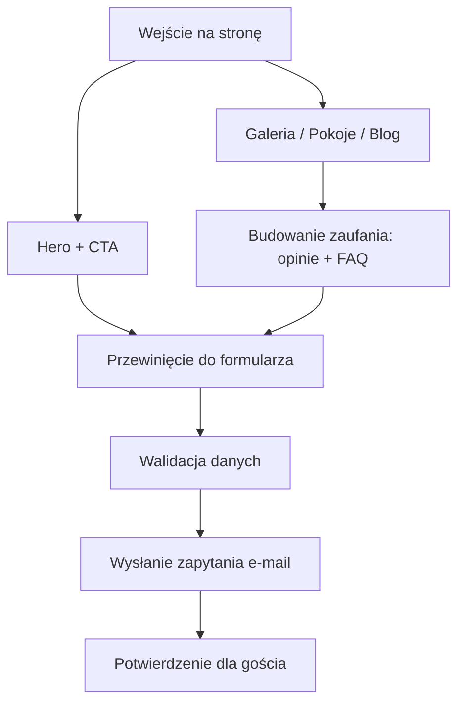

## 1. Przegląd produktu
Willa Szymkówka to luksusowy pensjonat w Zakopanem (ul. Strążyska 1H), kierowany do gości premium szukających ciszy, czystości, widoku na Tatry i nowoczesnego komfortu w regionalnym klimacie.
- Cel: maksymalizacja zapytań o nocleg dzięki czytelnemu przekazowi, social proof oraz formularzowi zapytania jako głównej akcji.
- Wartość: szybkie budowanie zaufania (opinie Google, FAQ), atrakcyjna prezentacja wnętrz i lokalizacji, wysoka jakość UX na mobile.

## 2. Kluczowe funkcje

### 2.1 Role użytkowników
| Rola | Sposób korzystania | Uprawnienia |
|------|---------------------|------------|
| Gość (klient) | Bez logowania | Przegląd treści, galeria, blog, wysłanie zapytania |

### 2.2 Moduły funkcjonalne
1. **Strona główna**: hero + CTA do formularza, galeria premium (kategorie), opinie Google, FAQ SEO, zajawki bloga, formularz, stopka z danymi
2. **Pokoje i apartamenty**: opis standardu, wyposażenie, udogodnienia, podstawowe informacje o pobycie, CTA do formularza
3. **Galeria**: widok kategorii + pełnoekranowe podglądy (lightbox)
4. **Blog**: lista wpisów SEO + strona wpisu (nagłówki, FAQ we wpisie opcjonalnie)
5. **Kontakt / Rezerwacja**: formularz jako główny element + dane, mapa (link do Google Maps)

### 2.3 Szczegóły stron
| Nazwa strony | Moduł | Opis funkcji |
|------------|-------|--------------|
| Strona główna | Hero | Duże zdjęcie/wideo loop, nagłówek klimatyczny, podtytuł lokalizacji, CTA przewijające do formularza |
| Strona główna | Galeria premium | Responsywny grid/slider, filtrowanie kategorii: Pokoje, Łazienki, Aneks, Obejście, Widoki |
| Strona główna | Opinie | Karty opinii z oceną 4.9/5 na bazie 183 recenzji Google; cytaty: Marlena i Milena |
| Strona główna | FAQ | Accordion zoptymalizowany pod SEO (treści dostarczone), możliwość oznaczenia strukturalnego FAQPage |
| Strona główna | Blog (zajawki) | 3 zapowiedzi wpisów z linkiem do /blog i /blog/:slug |
| Strona główna | Formularz | Walidacja pól, UX mobile-first, generowanie treści zapytania i wysyłka przez e-mail (bez backendu) |
| Strona główna | Stopka | Pełne dane teleadresowe + quick links |
| Pokoje i apartamenty | Standard | Opis wyposażenia, czystość, kuchnie/aneksy, Wi‑Fi, balkony/widoki, “chalet modern alpine” |
| Galeria | Lightbox | Powiększanie zdjęć, nawigacja klawiaturą, lazy-loading |
| Blog | Lista wpisów | Karty wpisów z datą i czasem czytania, meta tytuły/description |
| Blog | Wpis | Struktura artykułu z H1/H2, sekcje, CTA do formularza, breadcrumbs |
| Kontakt / Rezerwacja | Formularz | Sekcja formularza + dane + link do mapy, CTA telefon/e-mail |

## 3. Główne procesy
1. Gość wchodzi na stronę główną → widzi hero i CTA → przewija do formularza → wypełnia dane pobytu → wysyła zapytanie.
2. Gość przegląda galerię → filtruje kategorie → powiększa zdjęcia → przechodzi do formularza z CTA.
3. Gość trafia z Google do wpisu blogowego → czyta artykuł → klika CTA → wysyła zapytanie.

## 4. Projekt interfejsu (UI/UX)

### 4.1 Styl wizualny
- Kierunek: Modern Alpine / Chalet Premium (minimalizm + detale regionalne).
- Tło: subtelna, luksusowa tekstura podstarzanych desek (ciemne/naturalne drewno) w hero i jako separator między sekcjami; zapewnić kontrast przez overlay.
- Nagłówek: nazwa “Willa Szymkówka” + elegancka rozetka góralska (wektor/PNG).
- Kolory (przykładowe): ciemne drewno (tło), krem/biel (tekst), mosiądz/złoto (akcent), zgaszona zieleń (dodatkowy akcent).
- Typografia: szeryfowy font display (nagłówki) + czytelny bezszeryfowy font tekstowy; duże interlinie, premium spacing.

### 4.2 Motion i mikrointerakcje
- Delikatny fade-in sekcji przy przewijaniu (IntersectionObserver).
- Subtelne hover’y: podbicie kontrastu, lekki parallax w hero, płynne przejścia 200–300ms.
- Fokus na dostępność: czytelne focus states, brak agresywnych animacji.

### 4.3 SEO i semantyka
- Semantyczne HTML5: header/main/section/article/aside/footer.
- Struktura nagłówków: 1×H1 na stronie, H2/H3 dla sekcji.
- Dane strukturalne: LocalBusiness + FAQPage (na stronie głównej), Article (dla wpisów).
- Meta: title/description, OpenGraph/Twitter, canonical, alt teksty w galerii.

### 4.4 Responsywność (mobile-first)
- Priorytet iPhone: duże pola formularza, sticky CTA na mobile (opcjonalnie), bezpieczne marginesy, czytelna typografia.
- Obrazy: lazy-loading, srcset, utrzymanie ostrości i kompresja.
